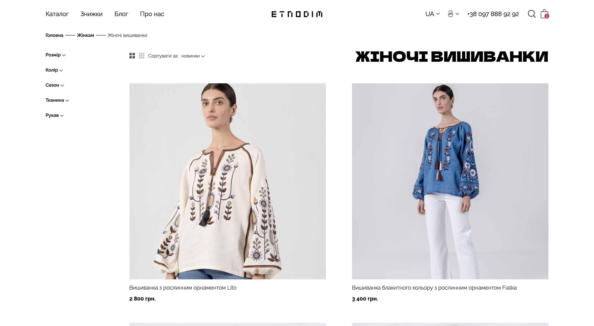
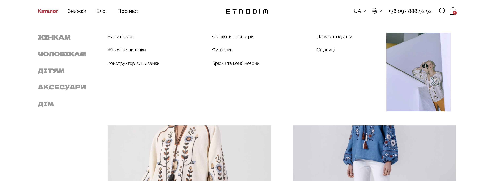
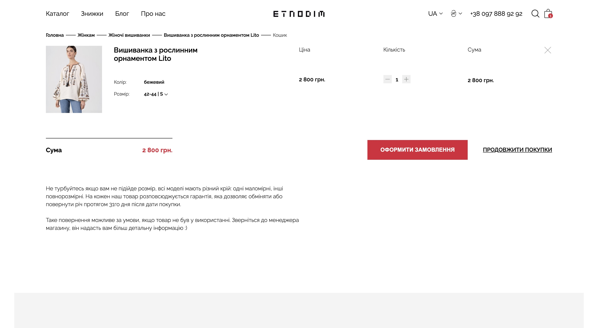

# Etnodim Landing Page | Front-end Beginnig Course Project

The final project completed during the Front-end Beginning Course with Online Institute [Projector](https://prjctr.com).

## Table of Contents

- [UI Screenshot](#ui-screenshot)
- [Introduction](#introduction)
- [Find a Bug?](#find-a-bug)
- [Other Information](#other-information)

## UI Screenshot 

*Etnodim landing page*

*Pop-up menu on hover*

*Cart Page*

## Introduction

[Etnodim](https://etnodim.ua) is a modern Ukrainian ethno clothing brand that draws inspiration from traditional clothing. This project marks first foray into creating pixel-perfect responsive code based on a provided UI for a real client, applying our **HTML** and **CSS** knowledge. 

Throughout this project, we honed our styling methods, connected fonts, implemented filterable inputs, designed versions of the menu for both desktop and mobile devices, and worked extensively with Media Queries.

When you explore this project, you'll be able to:

- **Interact with Filters**;
- **Explore Header Animation:** experience a hover-triggered pop-up menu;
- **Access the Cart Page:** Simply click on the 'bag' icon to access your cart.

Exploring this project offers the opportunity to engage with dynamic filters, observe subtle header animations, experience pop-up menus on hover, and easily access the cart page by clicking on the 'bag' icon.

## Find a bug? 

If you encounter any issues or would like to submit an improvement to this project, please don't hesitate to create an issue using the "Issues" tab above!

## Other Information

The project is available online! You can [view it here](https://elaborate-souffle-267b2a.netlify.app). Enjoy exploring!

Deployed on [Netlify](https://www.netlify.com).
